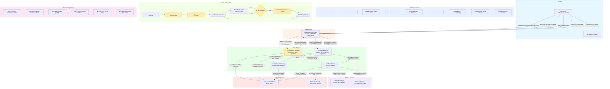

# Project-Terminal
*A comprehensive POS Terminal powered by Godot*

```mermaid
flowchart TD
    %% Define component groups with clearer organization
    
    subgraph UI["UI Layer"]
        style UI fill:#e6f7ff,stroke:#99d6ff
        LoginScreen["Login.cs User authentication interface"]
        MainScreen["Home.tscn Main application interface"]
    end

    subgraph Facade["Facade Layer"]
        style Facade fill:#fff2e6,stroke:#ffcc99
        TSM["TerminalSessionManager.cs Provides unified API & relays signals"]
    end
    
    subgraph Core["Core Managers"]
        style Core fill:#e6ffe6,stroke:#99ff99
        AuthManager["AuthManager.cs Manages authentication state & operations"]
        TerminalManager["TerminalManager.cs Handles terminal identity & registration"]
        SecureStorage["SecureStorage.cs Securely stores sensitive application data"]
        SupabaseClient["SupabaseClient.cs Communicates with Supabase services"]
    end
    
    subgraph External["External Services"]
        style External fill:#f9e6ff,stroke:#d699ff
        SupabaseAuth["Supabase Auth API Handles authentication requests"]
        SupabaseDB["Supabase Database Stores application data"]
    end
    
    subgraph Utility["Utility Components"]
        style Utility fill:#ffe6e6,stroke:#ff9999
        Logger["Logger.cs Centralized logging system"]
        EnvLoader["EnvLoader.gd Loads environment variables"]
    end
    
    subgraph AuthFlow["Authentication Flow"]
        style AuthFlow fill:#e6f2ff,stroke:#99ccff
        A1["User enters phone number"] --> A2["Request OTP via Supabase"]
        A2 --> A3["Supabase sends SMS to user"]
        A3 --> A4["User enters OTP code"]
        A4 --> A5["Code verified with Supabase"]
        A5 --> A6["Session created & stored"]
        A6 --> A7["Session saved in SecureStorage"]
        A7 --> A8["SessionChanged signal emitted"]
        A8 --> A9["UI updates based on session"]
    end
    
    subgraph SessionMgmt["Session Management"]
        style SessionMgmt fill:#f2ffe6,stroke:#ccff99
        S1["New session received from Supabase"] --> S2["SetSession() called on Supabase client"]
        S2 --> S3["UTC expiry timestamp calculated"]
        S3 --> S4["Session stored securely"]
        S4 --> S5["Timer checks session every 5 minutes"]
        S5 --> S6{"Is token expiring?"}
        S6 -->|Yes| S7["RefreshSessionAsync() called"]
        S6 -->|No| S5
        S7 --> S8["New token retrieved"]
        S8 --> S4
    end
    
    subgraph Registration["Terminal Registration"]
        style Registration fill:#ffe6f2,stroke:#ff99cc
        T1["Staff with proper permissions initiates"] --> T2["Permission check via CurrentUserRole"]
        T2 --> T3["Terminal ID generated (GUID)"]
        T3 --> T4["Terminal record created in database"]
        T4 --> T5["Terminal identity stored locally"]
        T5 --> T6["TerminalIdentityChanged signal emitted"]
    end
    
    %% Define signal connections
    AuthManager --"SessionChanged Signal (login, logout, refresh)" --> TSM
    TSM --"SessionChanged Signal (relayed to UI)" --> LoginScreen
    TerminalManager --"TerminalIdentityChanged Signal (registration, update)" --> TSM
    
    %% Method calls with detailed labels
    LoginScreen -- "RequestStaffLoginOtpAsync(phoneNumber)" --> TSM
    LoginScreen -- "VerifyStaffLoginOtpAsync(phone, otp)" --> TSM
    LoginScreen -- "IsStaffLoggedIn() check" --> TSM
    LoginScreen -- "CallDeferred() to change scene" --> MainScreen
    
    %% Facade delegation
    TSM -- "Delegates authentication requests & session management" --> AuthManager
    TSM -- "Delegates terminal identity & registration operations" --> TerminalManager
    
    %% Core manager interactions
    AuthManager -- "Stores/retrieves session data & expiry" --> SecureStorage
    AuthManager -- "Auth API calls (OTP, verification, refresh)" --> SupabaseClient
    TerminalManager -- "Stores/retrieves terminal identity" --> SecureStorage
    TerminalManager -- "DB operations (terminal registration, checks)" --> SupabaseClient
    
    %% External service communication
    SupabaseClient -- "Authentication requests (sign in, verify, refresh)" --> SupabaseAuth
    SupabaseClient -- "Data operations (CRUD on terminal records)" --> SupabaseDB
    SupabaseClient -- "Retrieves API credentials (URL, key)" --> EnvLoader
    
    %% Logging system
    AuthManager -- "Log auth events (debug, info, error)" --> Logger
    TerminalManager -- "Log terminal events (registration, updates)" --> Logger
    SecureStorage -- "Log storage operations (store, retrieve, errors)" --> Logger
    SupabaseClient -- "Log API operations (requests, responses)" --> Logger
    
    %% Key business logic highlights
    classDef authHighlight fill:#ffecb3,stroke:#ffcc00,stroke-width:2px
    class AuthManager,VerifyStaffLoginOtpAsync,S2,S3,S6,S7 authHighlight
```
